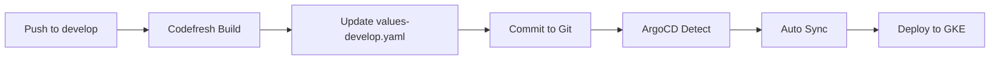
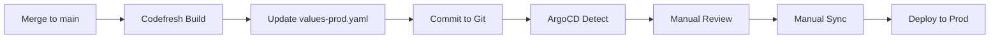

# ArgoCD Application Manifests

ArgoCD Application manifests สำหรับ deploy `test-devops` ไปยัง environments ต่างๆ

## 📁 โครงสร้าง

```
menifest/test-devops/
├── develop/
│   └── test-devops-develop.yaml    # Development environment
├── uat/
│   └── test-devops-uat.yaml        # UAT environment
└── prod/
    ├── test-devops-prod-gke.yaml   # Production on GKE
    └── test-devops-prod-eks.yaml   # Production on EKS
```

## 🎯 Environments

### Development
- **File**: `develop/test-devops-develop.yaml`
- **Branch**: `HEAD` (latest commit)
- **Values**: `values-develop.yaml`
- **Namespace**: `test-devops-develop`
- **Auto Sync**: ✅ Enabled
- **Self Heal**: ✅ Enabled

### UAT
- **File**: `uat/test-devops-uat.yaml`
- **Branch**: `uat`
- **Values**: `values-uat.yaml`
- **Namespace**: `test-devops-uat`
- **Auto Sync**: ✅ Enabled
- **Self Heal**: ✅ Enabled

### Production (GKE)
- **File**: `prod/test-devops-prod-gke.yaml`
- **Branch**: `main`
- **Values**: `values-prod-gke.yaml`
- **Namespace**: `test-devops-prod`
- **Auto Sync**: ❌ Manual only
- **Self Heal**: ❌ Disabled

### Production (EKS)
- **File**: `prod/test-devops-prod-eks.yaml`
- **Branch**: `main`
- **Values**: `values-prod-eks.yaml`
- **Namespace**: `test-devops-prod`
- **Auto Sync**: ❌ Manual only
- **Self Heal**: ❌ Disabled

## 🚀 การใช้งาน

### ติดตั้ง ArgoCD ก่อน

```bash
# สร้าง namespace
kubectl create namespace argocd

# ติดตั้ง ArgoCD
kubectl apply -n argocd -f https://raw.githubusercontent.com/argoproj/argo-cd/stable/manifests/install.yaml

# รอให้ pods พร้อม
kubectl wait --for=condition=available --timeout=600s deployment/argocd-server -n argocd

# ดึง admin password
kubectl -n argocd get secret argocd-initial-admin-secret -o jsonpath="{.data.password}" | base64 -d

# Port forward (สำหรับ local testing)
kubectl port-forward svc/argocd-server -n argocd 8080:443
```

### Deploy Applications

**Development:**
```bash
kubectl apply -f develop/test-devops-develop.yaml
```

**UAT:**
```bash
kubectl apply -f uat/test-devops-uat.yaml
```

**Production (GKE):**
```bash
kubectl apply -f prod/test-devops-prod-gke.yaml
```

**Production (EKS):**
```bash
# ⚠️ ต้อง add EKS cluster ใน ArgoCD ก่อน
argocd cluster add <eks-context-name>

kubectl apply -f prod/test-devops-prod-eks.yaml
```

**Deploy ทั้งหมด:**
```bash
kubectl apply -f . -R
```

## 🔍 ตรวจสอบสถานะ

### ใช้ kubectl

```bash
# List applications
kubectl get applications -n argocd

# Get specific app
kubectl get application test-devops-develop -n argocd -o yaml

# Watch applications
kubectl get applications -n argocd -w
```

### ใช้ ArgoCD CLI

```bash
# ติดตั้ง CLI
brew install argocd

# Login
argocd login localhost:8080 --username admin --password <password> --insecure

# List applications
argocd app list

# Get application details
argocd app get test-devops-develop

# View manifests
argocd app manifests test-devops-develop

# Sync application
argocd app sync test-devops-develop

# Wait for sync
argocd app wait test-devops-develop --health
```

## 🔄 Workflow

### Development Workflow



1. Developer push code to `develop` branch
2. Codefresh pipeline builds image
3. Codefresh updates `values-develop.yaml` with new image tag
4. Codefresh commits changes back to Git
5. ArgoCD detects changes (every 3 minutes)
6. ArgoCD auto-syncs to cluster

### Production Workflow



1. Merge PR to `main` branch
2. Codefresh pipeline builds image
3. Codefresh updates `values-prod-gke.yaml`
4. Codefresh commits changes
5. ArgoCD detects changes
6. **Ops team reviews** changes in ArgoCD UI
7. **Manual sync** to production

## 📝 Configuration Details

### Helm Values Merge

ArgoCD จะ merge values ในลำดับนี้:
1. `values.yaml` (default values)
2. `values-<env>.yaml` (environment-specific)
3. `parameters` จาก Application manifest

Example:
```yaml
# values.yaml
app:
  replicaCount: 1
  image:
    tag: latest

# values-develop.yaml
app:
  image:
    tag: develop-latest  # ← override
  resources:
    limits:
      cpu: 100m         # ← เพิ่มใหม่

# Result
app:
  replicaCount: 1           # from values.yaml
  image:
    tag: develop-latest     # from values-develop.yaml
  resources:
    limits:
      cpu: 100m            # from values-develop.yaml
```

### Sync Options

| Option | Development | Production | Description |
|--------|-------------|------------|-------------|
| `CreateNamespace` | ✅ | ✅ | สร้าง namespace อัตโนมัติ |
| `PrunePropagationPolicy` | foreground | foreground | ลบ resources แบบ foreground |
| `ServerSideApply` | ✅ | ✅ | ใช้ server-side apply |
| `Validate` | ✅ | ✅ | Validate manifests ก่อน apply |
| `Prune` (auto) | ✅ | ❌ | ลบ resources ที่ไม่มีใน Git |
| `SelfHeal` (auto) | ✅ | ❌ | แก้ไขการเปลี่ยนแปลงอัตโนมัติ |

## 🔒 Security Best Practices

### 1. Repository Access
```bash
# เพิ่ม repository ด้วย SSH key
kubectl create secret generic github-ssh-key \
  --from-file=ssh-privatekey=$HOME/.ssh/argocd_ed25519 \
  -n argocd
```

### 2. RBAC
```yaml
# ตัวอย่าง AppProject สำหรับแต่ละ environment
apiVersion: argoproj.io/v1alpha1
kind: AppProject
metadata:
  name: development
  namespace: argocd
spec:
  destinations:
    - namespace: test-devops-develop
      server: https://kubernetes.default.svc
  sourceRepos:
    - https://github.com/extosoft-devsecops/test-devops-gitops.git
```

### 3. Secrets Management
- ใช้ **Sealed Secrets** หรือ **External Secrets Operator**
- ไม่เก็บ secrets ใน Git แบบ plain text

## 🚨 Troubleshooting

### Application OutOfSync

```bash
# Hard refresh
argocd app get test-devops-develop --hard-refresh

# Diff
argocd app diff test-devops-develop

# Force sync
argocd app sync test-devops-develop --force
```

### Cannot Connect to Repository

```bash
# ตรวจสอบ repository
argocd repo list

# เพิ่มใหม่
argocd repo add https://github.com/extosoft-devsecops/test-devops-gitops.git

# หรือใช้ SSH
argocd repo add git@github.com:extosoft-devsecops/test-devops-gitops.git \
  --ssh-private-key-path ~/.ssh/argocd_ed25519
```

### Helm Template Errors

```bash
# ดู rendered manifests
argocd app manifests test-devops-develop

# ทดสอบ local
cd helms/test-devops
helm template . -f values-develop.yaml --debug
```

## 📊 Monitoring

### ArgoCD Notifications

ตัวอย่าง Slack notification:
```yaml
apiVersion: v1
kind: ConfigMap
metadata:
  name: argocd-notifications-cm
  namespace: argocd
data:
  service.slack: |
    token: $slack-token
  
  trigger.on-deployed: |
    - when: app.status.operationState.phase in ['Succeeded']
      send: [app-deployed]
  
  template.app-deployed: |
    message: |
      Application {{.app.metadata.name}} deployed successfully!
      {{.context.argocdUrl}}/applications/{{.app.metadata.name}}
```

## 📚 อ้างอิง

- [ArgoCD Documentation](https://argo-cd.readthedocs.io/)
- [ArgoCD Best Practices](https://argo-cd.readthedocs.io/en/stable/user-guide/best_practices/)
- [Helm Values](../../helms/test-devops/README.md)

